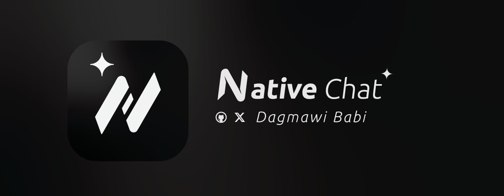
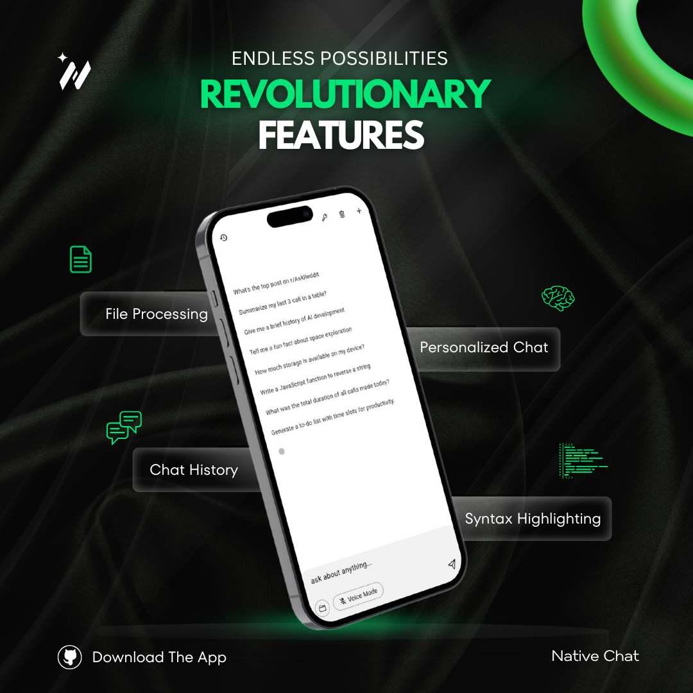

# NativeChat

NativeChat is a powerful application designed to bring seamless, context-aware interactions to your mobile device. Using Gemini under the hood, it offers a wide range of features to assist with tasks like fetching system specs, analyzing call logs, summarizing SMS messages, and providing insights into your device’s status. NativeChat makes your chat experience better by providing real-time data and personalized responses.

## Features

-   **Gemini-Powered Responses**: Leveraging the Gemini model, NativeChat generates insightful replies based on your device’s context and queries.
-   **Voice Mode**: Interact with NativeChat using your voice. It listens to your queries and responds with voice for a hands-free experience.
-   **System & Device Info**: Quickly access detailed information like device specs, battery status, installed apps, and more.
-   **Real-Time Assistance**: Retrieve and analyze your call logs, SMS messages, and system queries instantly.
-   **Versatile Coding Assistant**: Generate and debug code in various languages like Python, JavaScript, and Zig.

## Function Declarations

-   **Time** (getDeviceTime):

    -   Fetches the current date, time, and timezone of the device.

-   **Specs** (getDeviceSpecs):

    -   Retrieves system specifications and hardware details of the device.

-   **Call Logs** (getCallLogs):

    -   Retrieves a list of call history with details about each call (incoming, outgoing, missed).

-   **SMS** (getSMS):

    -   Retrieves a list of text messages, including sender, content, date, and read status.

-   **Battery** (getDeviceBattery):

    -   Provides the current battery level as a percentage and its charging state.

-   **Apps** (getDeviceApps):

    -   Returns a list of installed apps and their details such as name, package, and version.

-   **Clear Conversation** (clearConversation):
    -   Clears the current conversation history.

## Illustrations

## Contributing

We welcome contributions to improve NativeChat! Here's how you can help:

1. **Fork the Repository**: Create your own fork of the project on GitHub.
2. **Clone the Repository**: Clone your fork locally to make changes.
3. **Make Changes**: Implement bug fixes, add new features, or improve existing code.
4. **Push Changes**: Push your changes to your forked repository.
5. **Create a Pull Request**: Open a pull request to submit your changes for review.

## License

NativeChat is open-source and licensed under the MIT License. See [LICENSE](LICENSE) for details.
